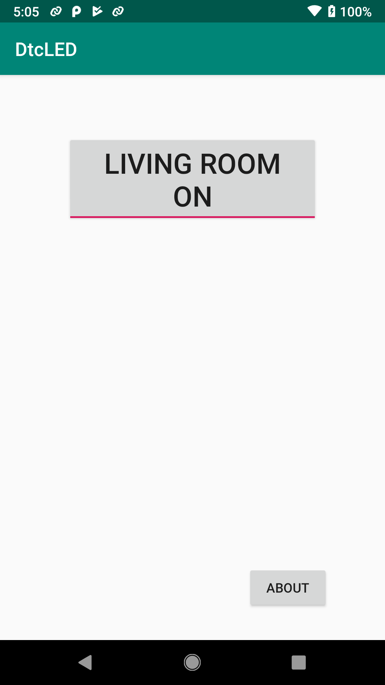
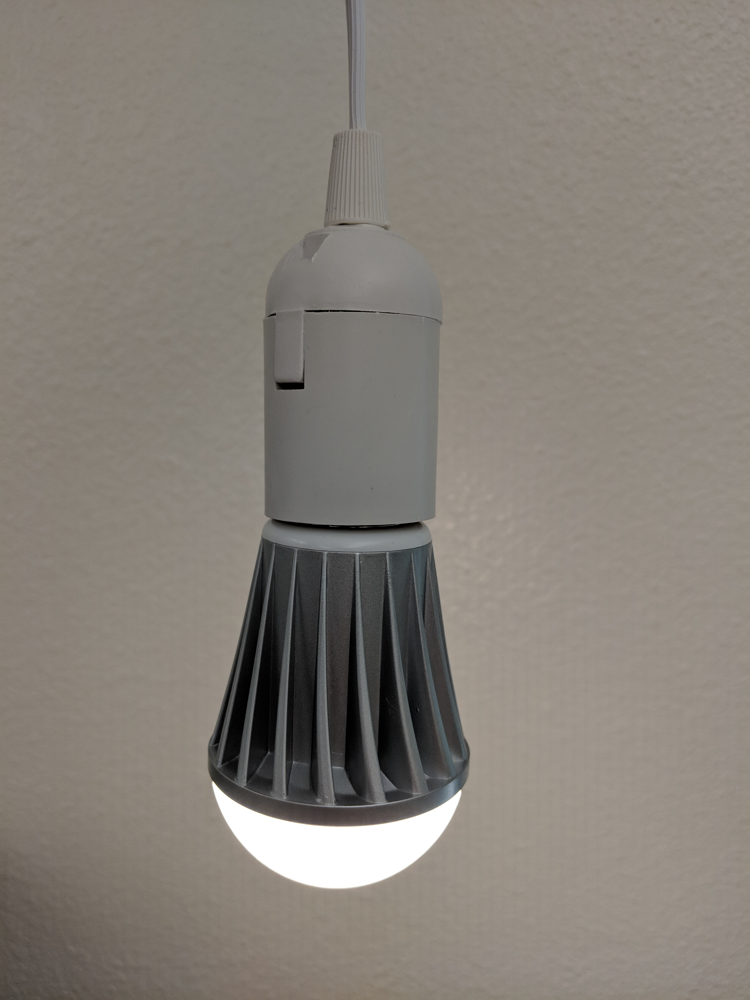

# dtc-ble-led

I have some [MagicLight BLE light bulbs](https://www.amazon.com/Magic-Light-Bluetooth-Smart-Bulb/dp/B073S1KV4F?ref_=bl_dp_s_web_9321634011) at home. To control them, I made a very simple Android app.

More about how to control these LED bulbs, refer to this [repo](https://github.com/skydoves/MagicLight-Controller)

Note:

* Enable  Location permission to your app if it cannot scan BLE devices.
